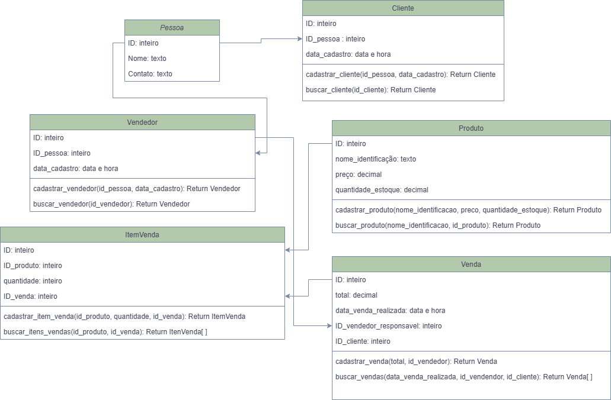

# API REST Gestão e Venda de Produtos
Esta API (Application program Interface) Efetua processos de Gestão e Vendas de Produtos
## Requisitos Funcionais
- Cadastro de Produtos
- Busca de Produtos por ID
- Cadastro de Clientes e Vendedores
- Busca de Clientes e Vendedores
- Registros de Vendas
- Gestão de Produtos em Estoque
## Regras de Negócios
- Um cliente só pode efetuar uma compra se já estiver cadastrado no sistema.
- Um vendedor só pode efetuar uma compra se estiver cadastrado no sistema.
- A venda de um produto só pode ocorrer se o produto já estiver registrado no sistema.
- Após a venda de um produto ocorrer deve-se registar baixa no estoque.
## Modelagem de Classes 
 